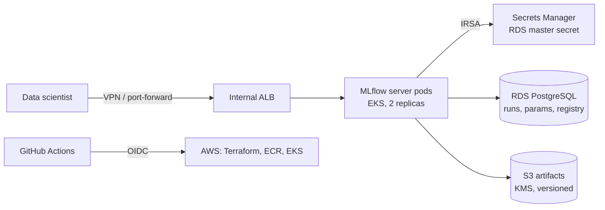

# MLflow on Amazon EKS

A production-style **MLflow tracking server and model registry** on Amazon EKS, built with Terraform and Kustomize.

- **Backend store:** RDS PostgreSQL, with the password managed by AWS Secrets Manager. It never lands in Kubernetes.
- **Artifact store:** a versioned, KMS-encrypted, TLS-only S3 bucket with lifecycle rules.
- **Access:** IRSA. The pod reads the DB secret and S3 with a scoped IAM role; there are no static keys.
- **Exposure:** an internal ALB only, because MLflow has no built-in authentication.
- **CI/CD:** GitHub Actions validates everything on every push; a manual `deploy` workflow applies Terraform, builds the image, and rolls it out using GitHub OIDC.

> **Status:** code complete and validated in CI (terraform validate, kubeconform, unit tests). Deploy it to your own AWS account to try it end to end.

## Architecture



## Repository layout

| Path | What it holds |
|---|---|
| `terraform/` | S3 artifact bucket, RDS PostgreSQL, security group, ECR repo, IRSA role |
| `docker/` | MLflow server image; `entrypoint.py` fetches DB credentials at start-up |
| `k8s/base`, `k8s/overlays/dev` | Namespace (restricted PSS), Deployment, Service, PDB, internal Ingress |
| `examples/train.py` | Trains a scikit-learn model, logs it, and registers it in the model registry |
| `scripts/render-overlay.sh` | Writes `terraform output` values into the overlay |
| `.github/workflows/` | `ci.yml` validation; `deploy.yml` manual deploy |

## Prerequisites

- An EKS cluster (1.29+) with an IAM OIDC provider and the AWS Load Balancer Controller installed
- Terraform 1.6+, kubectl, kustomize, Docker and the AWS CLI
- An S3 bucket for Terraform state

## Deploy

```bash
# 1. Infrastructure
cp terraform/terraform.tfvars.example terraform/terraform.tfvars   # edit the values
cp terraform/backend.hcl.example terraform/backend.hcl             # edit the values
terraform -chdir=terraform init -backend-config=backend.hcl
terraform -chdir=terraform apply

# 2. Image
REPO=$(terraform -chdir=terraform output -raw ecr_repository_url)
aws ecr get-login-password | docker login --username AWS --password-stdin "${REPO%%/*}"
docker build -t "$REPO:2.17.2-1" docker/ && docker push "$REPO:2.17.2-1"

# 3. Kubernetes
scripts/render-overlay.sh 2.17.2-1
kubectl apply -k k8s/overlays/dev
kubectl -n mlflow rollout status deployment/mlflow
```

## Use it

```bash
kubectl -n mlflow port-forward svc/mlflow 5000:80
export MLFLOW_TRACKING_URI=http://localhost:5000
pip install -r requirements-dev.txt
python examples/train.py --n-estimators 200 --max-depth 6
```

Open http://localhost:5000 to see the run and the registered model `wine-classifier`.

## Deploying from GitHub Actions

Set these repository **variables**: `AWS_DEPLOY_ROLE_ARN` (a role trusting GitHub OIDC for this repo), `AWS_REGION`, `TF_STATE_BUCKET`, `EKS_CLUSTER_NAME`, `VPC_ID` and `PRIVATE_SUBNET_IDS` (HCL list, e.g. `["subnet-a","subnet-b"]`). Then run the **deploy** workflow with an image tag.

## Cost and clean-up

The main costs are RDS (`db.t4g.micro`, roughly $12/month), the internal ALB and S3 storage. To tear down, set `deletion_protection = false`, apply, then run:

```bash
kubectl delete -k k8s/overlays/dev
terraform -chdir=terraform destroy
```

## Local checks

```bash
make validate   # terraform fmt/validate + kubeconform
make test       # ruff + pytest
```
