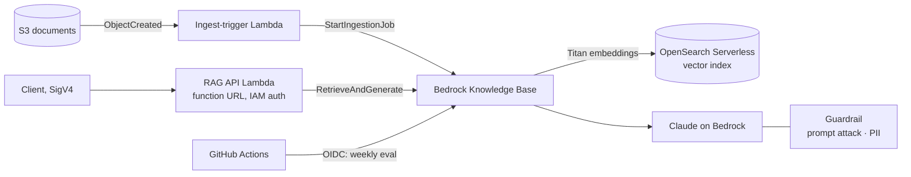

# Bedrock RAG Platform

A production-style **Retrieval-Augmented Generation** platform on AWS: **Amazon Bedrock Knowledge Bases** with an **OpenSearch Serverless** vector store, **Guardrails**, an IAM-secured API, automatic re-ingestion and an **evaluation gate**. Everything is built with Terraform.

- **Ingestion:** documents land in S3, an S3 event triggers a Lambda that starts a knowledge-base ingestion job, and Bedrock chunks the text (400 tokens, 15% overlap), embeds it with Titan Text Embeddings v2 and writes it to the vector index.
- **Answering:** a Lambda API calls `RetrieveAndGenerate` (top-5 retrieval, temperature 0) and returns the answer with **source citations**.
- **Safety:** a Bedrock Guardrail blocks prompt attacks and hateful or violent content, anonymises emails and phone numbers, and blocks card numbers.
- **Security:**
  - The function URL uses **AWS_IAM** auth, so it isn't public.
  - IAM policies are scoped per role.
  - The OpenSearch data-access policy lists its principals explicitly.
  - The docs bucket is encrypted and blocks public access.
- **Quality:** `eval/run_eval.py` scores the answers to a golden question set (keyword recall and citation rate) and fails below a threshold. It runs weekly, or on demand, from GitHub Actions using OIDC.

> **Status:** code complete and validated in CI (terraform validate, 8 unit tests for the API, ingestion trigger, index mapping and evaluation scoring). Deploy it to your own account to try it end to end; you need Bedrock model access for Titan Embeddings v2 and Claude.

## Architecture



## Layout

| Path | What it holds |
|---|---|
| `terraform/main.tf` | Docs bucket, OpenSearch Serverless collection and policies, knowledge-base role, knowledge base, S3 data source, guardrail |
| `terraform/lambdas.tf` | RAG API (function URL), ingestion trigger, S3 notification |
| `scripts/create_index.py` | Creates the k-NN index (FAISS HNSW, 1024 dimensions) |
| `src/rag_api`, `src/ingest_trigger` | Lambda handlers |
| `eval/` | Golden question set and evaluation gate |
| `docs/sample/` | Invented sample documents for a demo |

## Deploy (two phases)

The knowledge base requires the vector index to exist first, so you apply Terraform in two phases:

```bash
cp terraform/terraform.tfvars.example terraform/terraform.tfvars   # set admin_principal_arns to your role
terraform -chdir=terraform init -backend-config=backend.hcl
make phase1            # bucket, collection, policies, roles, guardrail
make index             # create the vector index
make phase2            # knowledge base, data source, Lambdas
make docs              # upload sample docs; ingestion starts automatically
make ask Q="How many days of annual leave do full-time employees get?"
```

## Cost and clean-up

OpenSearch Serverless bills for at least 1 OCU while the collection exists (roughly $175/month with standby replicas disabled), so **destroy it when you're done**:

```bash
terraform -chdir=terraform destroy -var create_knowledge_base=true
```
