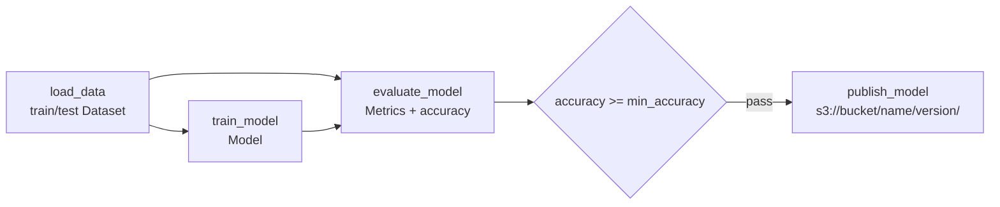

# Kubeflow Training Pipeline on Amazon EKS

A **Kubeflow Pipelines (KFP v2)** training workflow on EKS: load data → train → evaluate → an **accuracy gate** → publish the approved model to S3.

- **Install:** Kubeflow Pipelines 2.3 standalone via Kustomize, pinned to a release tag. The `pipeline-runner` service account is patched with an IRSA role.
- **Pipeline:** typed artifacts (`Dataset`, `Model`, `Metrics`) connect the steps, so the lineage and metrics show up in the KFP UI.
- **Quality gate:** `dsl.If(accuracy >= min_accuracy)`. Only models that pass are published to S3, under a timestamped version prefix.
- **Security:** components write to S3 through IRSA, with no access keys in the cluster. The bucket is encrypted, versioned and blocks public access.
- **CI:** Terraform validation, Kubeflow manifest validation, unit tests that run each component locally, and the compiled pipeline YAML uploaded as a build artifact.

> **Status:** code complete and validated in CI (terraform validate, kubeconform on the rendered KFP manifests, component tests). Deploy it to your own EKS cluster to try it end to end.

## Pipeline



## Layout

| Path | What it holds |
|---|---|
| `terraform/` | Model bucket and IRSA role for `kubeflow/pipeline-runner` |
| `k8s/kfp/cluster-scoped`, `k8s/kfp/platform` | KFP 2.3.0 standalone install, plus the IRSA patch |
| `pipelines/components.py` | Four lightweight Python components |
| `pipelines/training_pipeline.py` | Pipeline DAG with the gate; `python -m pipelines.training_pipeline` compiles it |
| `pipelines/submit.py` | Submits a run to a KFP endpoint |

## Run it

```bash
terraform -chdir=terraform init -backend-config=backend.hcl
terraform -chdir=terraform apply -var cluster_name=my-eks-cluster
# Put runner_role_arn into k8s/kfp/platform/kustomization.yaml, then:
make install-kfp
make ui &                                         # http://localhost:8080

pip install -r requirements-dev.txt
python -m pipelines.submit --host http://localhost:8080 \
  --bucket "$(terraform -chdir=terraform output -raw model_bucket)" --wait
```

You can also upload the compiled `training_pipeline.yaml` through the KFP UI and run it from there.

## Clean-up

```bash
kubectl delete -k k8s/kfp/platform && kubectl delete -k k8s/kfp/cluster-scoped
terraform -chdir=terraform destroy
```
