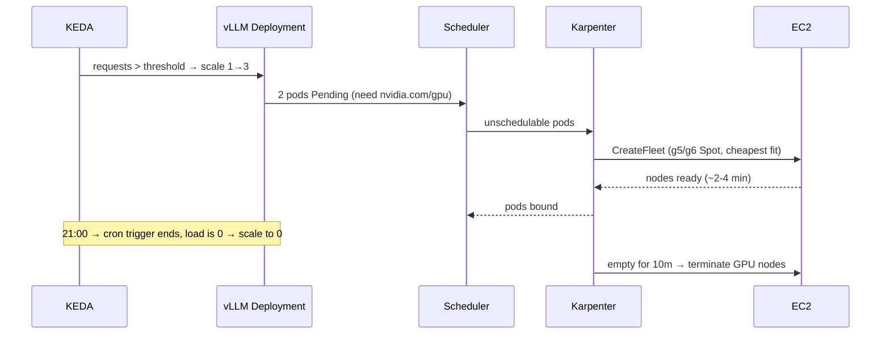

# Karpenter GPU Autoscaling for LLM Inference

**Cost-efficient GPU inference on EKS.** Karpenter launches the right GPU node just in time (Spot first, with On-Demand as fallback), KEDA scales the model server on real request load and to **zero outside working hours**, and empty GPU nodes are removed within minutes.

- **Karpenter** (Terraform):
  - controller IRSA role scoped to resources tagged for this cluster
  - node role with an EKS access entry, so `aws-auth` isn't edited
  - SQS interruption queue fed by EventBridge (Spot interruption, rebalance, state change, health)
- **GPU NodePool:** `g5`, `g6` and `g6e` single-GPU instances, Spot with On-Demand fallback, a `nvidia.com/gpu` taint, a **hard limit of 8 GPUs**, consolidation when empty, and a disruption budget of one node at a time.
- **Bottlerocket NVIDIA AMI:** drivers and device plugin are built in. IMDSv2 is required and the EBS volumes are encrypted, with a separate fast data volume for large model images.
- **General NodePool:** Graviton and x86 CPU nodes, consolidated when empty or under-utilised.
- **Workload:** vLLM serving Qwen2.5-1.5B on one GPU.
- **KEDA ScaledObject:**
  - Prometheus trigger on in-flight and queued requests
  - cron trigger that keeps one replica during business hours (IST)
  - scales to zero otherwise
- **Cost visibility:** `scripts/gpu_cost_report.py` turns `kubectl get nodes` into an hourly and monthly estimate per NodePool.

> **Status:** code complete and validated in CI (terraform validate, kubeconform against the Karpenter and KEDA CRD schemas, unit tests). Deploy it to your own EKS cluster to try it end to end; new accounts need a G-instance vCPU quota increase first.

## How scaling works



## Prerequisites

- EKS 1.29+ with an IAM OIDC provider and access entries enabled (`API` or `API_AND_CONFIG_MAP` authentication mode)
- Subnets and security groups tagged `karpenter.sh/discovery=<cluster>`
- kube-prometheus-stack, for the KEDA Prometheus trigger
- A G-instance vCPU quota

## Deploy

```bash
terraform -chdir=terraform init -backend-config=backend.hcl
terraform -chdir=terraform apply -var cluster_name=my-eks-cluster
# Replace my-eks-cluster in k8s/karpenter/*.yaml (role + discovery tags), then:
make pools
make workload
kubectl -n inference get pods -w          # watch Karpenter launch a GPU node
make cost
```

## Clean-up

```bash
kubectl delete -k k8s/workload && kubectl delete -k k8s/karpenter   # Karpenter drains and terminates its nodes
terraform -chdir=terraform destroy
```
