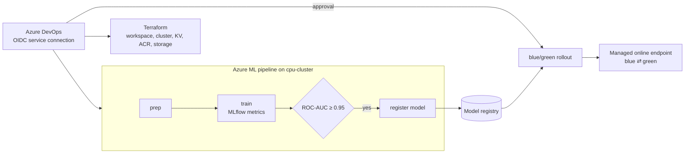

# Azure ML MLOps with Terraform and Azure DevOps

End-to-end MLOps on **Azure Machine Learning**: the workspace is built with Terraform, training runs as an **Azure ML pipeline** (prep → train → quality gate → register), and deployment is a **blue/green rollout to a managed online endpoint**. **Azure DevOps** drives it all, with workload-identity federation and approval gates.

- **Infrastructure** (Terraform, azurerm 4.x):
  - resource group, Log Analytics and Application Insights
  - Key Vault with RBAC and purge protection
  - storage account with versioning and TLS 1.2
  - ACR (admin disabled)
  - AML workspace (managed identity, v2)
  - training cluster: Low-Priority VMs that **scale to zero after 10 minutes**, local auth off, managed identity with Storage Blob Data Contributor
- **Pipeline** (`aml/pipeline.yaml`): three command components with typed inputs and outputs (`uri_folder`, `mlflow_model`). Metrics are tracked with MLflow, and a model is registered **only if ROC-AUC ≥ 0.95**.
- **Deployment:** a no-code MLflow deployment on a managed online endpoint with **AAD-token auth**. `blue_green.sh`:
  1. deploys the model to the idle colour
  2. smoke-tests it
  3. shifts 10% of traffic, then 100%
  4. removes the old colour
- **Azure DevOps stages:**
  - Validate: tests with published results, and Terraform validate
  - Infrastructure: on `main`, via the `mlops-dev` environment
  - Train
  - Deploy: through the `mlops-prod` environment, which has an **approval check**
  - All stages authenticate with **OIDC** (workload identity federation), so no secrets are stored.

> **Status:** code complete and validated in CI (terraform validate, and 5 tests covering the components end to end locally plus static checks that the pipeline and component YAML are wired correctly). Deploy it to your own Azure subscription to try it end to end.

## Architecture



## Layout

| Path | What it holds |
|---|---|
| `terraform/` | Workspace and dependencies, compute cluster, role assignment |
| `aml/environment/` | Training environment (conda + MLflow) |
| `aml/components/`, `aml/pipeline.yaml` | Components and pipeline job |
| `aml/endpoints/` | Endpoint, deployment template, sample request |
| `src/` | `prep.py`, `train.py`, `register.py` |
| `scripts/blue_green.sh` | Traffic-shifting rollout |
| `pipelines/azure-pipelines.yml` | Azure DevOps pipeline |

## Run it manually

```bash
az login
terraform -chdir=terraform init -backend-config=backend.hcl
terraform -chdir=terraform apply
az configure --defaults group=rg-mlops-dev workspace=mlw-mlops-dev
make train                                  # prep -> train -> gate -> register
make deploy RG=rg-mlops-dev WS=mlw-mlops-dev
az ml online-endpoint invoke -n breast-cancer-ep --request-file aml/endpoints/sample-request.json
```

## Cost and clean-up

The cluster costs nothing while idle, but the online endpoint bills per instance-hour, so delete it when you're finished:

```bash
az ml online-endpoint delete -n breast-cancer-ep --yes
terraform -chdir=terraform destroy
```

The provider refuses to delete a resource group that still holds resources Terraform doesn't manage, which is a safety net. If the destroy stops there, delete the leftover Azure ML resources it lists first.
