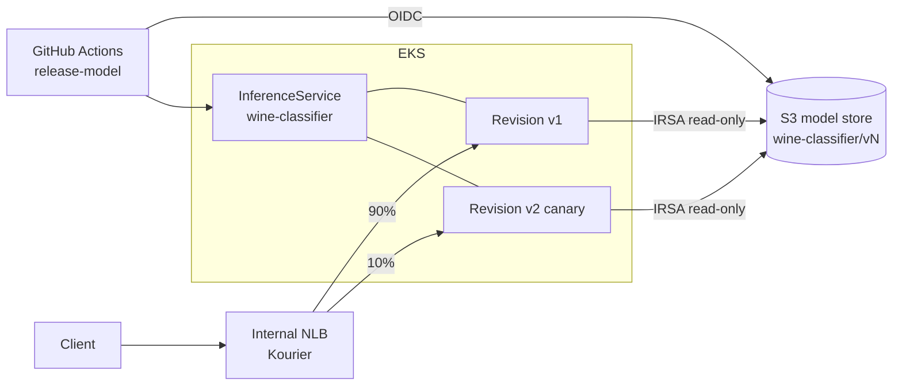

# KServe Model Serving on Amazon EKS

Serverless model inference on EKS with **KServe**, **Knative** and **Kourier**, including **canary rollouts**, one-command **promote/rollback** and a gated **model-release pipeline**.

- **Platform:** Terraform installs cert-manager, the Knative operator and KServe (Serverless mode) with Helm. Kourier replaces Istio to keep the footprint small.
- **Model store:** each model version lives under an immutable S3 prefix (`wine-classifier/v1`, `v2`, …). Predictors read it through IRSA.
- **Autoscaling:** Knative scales on concurrency, from 1 to 5 replicas.
- **Canary:** a new version first takes a set share of traffic (10% by default). `promote.sh` moves it to 100%, and `rollback` returns all traffic to the previous revision.
- **Release pipeline:** train → accuracy gate → publish to S3 → canary → smoke test using the Open Inference Protocol (v2).

> **Status:** code complete and validated in CI (terraform validate, kubeconform with CRD schemas, unit tests). Deploy it to your own AWS account to try it end to end.

## Architecture



## Layout

| Path | What it holds |
|---|---|
| `terraform/` | Model bucket, IRSA role, Helm releases (cert-manager, Knative operator, KServe) |
| `k8s/platform/` | `KnativeServing` custom resource with Kourier on an internal NLB |
| `k8s/models/` | InferenceService base, plus `stable` and `canary` overlays |
| `src/publish_model.py` | Trains, gates on accuracy and publishes an immutable version |
| `src/smoke_test.py` | Open Inference Protocol request and response check |
| `scripts/promote.sh` | `promote` or `rollback` the canary |

## Deploy

```bash
# Platform
terraform -chdir=terraform init -backend-config=backend.hcl
terraform -chdir=terraform apply -var cluster_name=my-eks-cluster
make bootstrap                                     # KnativeServing + Kourier

# First model version
BUCKET=$(terraform -chdir=terraform output -raw model_bucket)
python src/publish_model.py --bucket "$BUCKET" --version v1
# Set the role ARN and bucket in k8s/models (base serviceaccount + overlays), then:
kubectl apply -k k8s/models/overlays/stable

# Canary v2 at 10%, then promote
python src/publish_model.py --bucket "$BUCKET" --version v2 --n-estimators 200
kubectl apply -k k8s/models/overlays/canary
scripts/promote.sh promote        # or: scripts/promote.sh rollback
```

The KServe sklearn runtime loads the model with its own scikit-learn version, so keep the training version compatible with it (1.5.x for KServe 0.14).

## Pipeline variables

Set these repository variables: `AWS_DEPLOY_ROLE_ARN`, `AWS_REGION`, `EKS_CLUSTER_NAME` and `MODEL_BUCKET`. Then run the **release-model** workflow with a new version.

## Clean-up

```bash
kubectl delete -k k8s/models/overlays/stable
kubectl delete -k k8s/platform
terraform -chdir=terraform destroy
```
