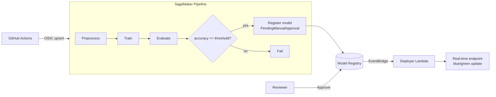

# SageMaker Pipelines: train → evaluate → register → deploy

An end-to-end **MLOps pipeline on Amazon SageMaker**, with the infrastructure in Terraform and the pipeline defined as code.

- **Pipeline:** `Preprocess → Train → Evaluate → CheckAccuracy`. If the model meets the accuracy threshold it is **registered** in the Model Registry as *PendingManualApproval*; otherwise the run **fails**.
- **Human gate:** a reviewer approves the model package in SageMaker Studio or the CLI.
- **Automatic deployment:** EventBridge catches the approval and triggers a Lambda that creates a new model and endpoint config, then creates the endpoint or updates it in place with a blue/green swap.
- **No SageMaker SDK needed:** the pipeline definition is plain JSON built in `pipeline/definition.py`, which keeps the dependencies small and makes it easy to unit-test.
- **Reproducible code:** scripts are packaged into a deterministic `sourcedir.tar.gz` under a content-addressed S3 prefix.
- **CI/CD:** GitHub Actions runs the tests on every push and upserts the pipeline from `main` using OIDC.

> **Status:** code complete and validated in CI (terraform validate, 16 unit tests covering the definition, scripts and deployer). Deploy it to your own AWS account to try it end to end.

## Architecture



## Layout

| Path | What it holds |
|---|---|
| `terraform/` | S3 bucket, SageMaker execution role, Model Package Group, EventBridge rule and deployer Lambda |
| `pipeline/definition.py` | Pipeline definition: parameters, steps, property file and condition |
| `pipeline/deploy_pipeline.py` | Packages the code, uploads it to S3, upserts the pipeline, optionally starts a run |
| `pipeline/code/` | `preprocess.py`, `train.py`, `evaluate.py`, `inference.py` |
| `lambda/deployer/handler.py` | Deploys approved model packages |

## Run it

```bash
terraform -chdir=terraform init -backend-config=backend.hcl
terraform -chdir=terraform apply

BUCKET=$(terraform -chdir=terraform output -raw bucket)
make sample-data BUCKET=$BUCKET          # or upload your own CSV with a "target" column

python -m pipeline.deploy_pipeline --name churn --bucket "$BUCKET" \
  --role-arn "$(terraform -chdir=terraform output -raw execution_role_arn)" \
  --model-package-group "$(terraform -chdir=terraform output -raw model_package_group)" --start

# After the run registers a model, approve it to trigger deployment:
aws sagemaker update-model-package --model-package-arn <arn> --model-approval-status Approved
```

Pipeline parameters (`NEstimators`, `LearningRate`, `AccuracyThreshold`, instance types and `InputDataUri`) can be overridden per execution.

**Other regions:** the default image is the scikit-learn 1.2-1 framework image in `us-east-1`. Pass `--image` with your region's URI from the [SageMaker image registry paths](https://docs.aws.amazon.com/sagemaker/latest/dg-ecr-paths/sagemaker-algo-docker-registry-paths.html).

## Cost and clean-up

Pipeline runs use on-demand `ml.m5.large` for a few minutes each. The endpoint bills per hour while it's running, so delete it when you're finished:

```bash
aws sagemaker delete-endpoint --endpoint-name churn
terraform -chdir=terraform destroy
```
