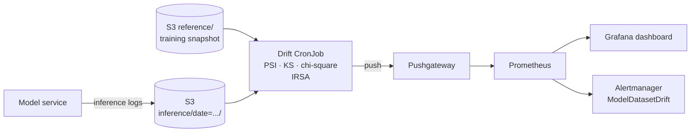

# Model Drift Monitoring on EKS

Daily **data-drift detection** for a production model. Results go to **Prometheus**, with **Grafana** dashboards and **alerts** that tell you when it's time to retrain.

- **Detection** (`src/drift/detector.py`):
  - numeric features: Population Stability Index (PSI) and the Kolmogorov-Smirnov test
  - categorical features: PSI and the chi-square test
  - an overall *drift share* across all features
  - lightweight: pandas, NumPy and SciPy only
- **Job:** a Kubernetes CronJob reads the training reference and the day's inference logs from S3 through IRSA, then pushes per-feature metrics to a Pushgateway.
- **Observability:** Terraform installs kube-prometheus-stack and the Pushgateway, and the Grafana dashboard is provisioned as code (ConfigMap sidecar).
- **Alerts** (PrometheusRule):
  - dataset drift of 30% or more
  - high PSI on any single feature
  - a job that hasn't succeeded for over 26 hours
- **CI:** Terraform validation, kubeconform with CRD schemas, `promtool check rules`, unit tests and an image build.

> **Status:** code complete and validated in CI (terraform validate, kubeconform, promtool, 7 unit tests including an S3 → metrics test). Deploy it to your own EKS cluster to try it end to end.

## Architecture



## Metrics

| Metric | Labels | Meaning |
|---|---|---|
| `model_feature_psi` | model, feature, kind | PSI against the reference |
| `model_feature_drift_p_value` | model, feature, kind | KS or chi-square p-value |
| `model_feature_drifted` | model, feature, kind | 1 if PSI ≥ 0.2 or p < 0.01 |
| `model_drift_share` | model | Share of drifted features |
| `model_drift_last_run_timestamp_seconds` | model | Freshness of the check |

## Run it

```bash
terraform -chdir=terraform init -backend-config=backend.hcl
terraform -chdir=terraform apply -var cluster_name=my-eks-cluster

BUCKET=$(terraform -chdir=terraform output -raw data_bucket)
python scripts/seed_demo_data.py --bucket "$BUCKET" --shift 20     # simulate drift

# Build and push the image, set the image, bucket and role in k8s/, then:
kubectl apply -k k8s/overlays/dev
kubectl -n monitoring create job drift-now --from=cronjob/model-drift
kubectl -n monitoring port-forward svc/kube-prometheus-stack-grafana 3000:80   # "Model drift" dashboard
```

## Clean-up

```bash
kubectl delete -k k8s/overlays/dev
terraform -chdir=terraform destroy
```
