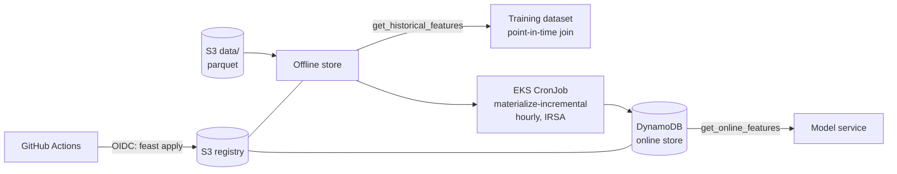

# Feast Feature Store on AWS

A **Feast** feature store on AWS, with **S3** as the offline store and registry and **DynamoDB** as the online store. An hourly **materialization CronJob** runs on EKS and uses IRSA for access.

- **Point-in-time correct training data:** `get_historical_features` joins each label with only the feature values that were known at its timestamp, so there's no leakage from the future.
- **Low-latency serving:** `get_online_features` reads the latest values from DynamoDB.
- **Feature services** (`driver_activity_v1`) version the exact feature set a model uses.
- **One config for every environment:** `feature_store.yaml` reads `${FEAST_BUCKET}` and `${AWS_REGION}`, so CI, laptops and the CronJob share it.
- **Least privilege:** the IAM policy covers the registry and data prefixes and only the `driver_stats.*` DynamoDB tables.
- **GitOps for features:** a pull request runs an end-to-end test on a local store; merging to `main` runs `feast plan` and `feast apply` against AWS using OIDC.

> **Status:** code complete. CI runs a real end-to-end Feast test (apply, materialize, online and historical retrieval) on a local SQLite/file store; the AWS path uses the same definitions. Deploy it to your own account to try it on AWS.

## Architecture



## Layout

| Path | What it holds |
|---|---|
| `feature_repo/` | `feature_store.yaml` (AWS) and `features.py` (entity, source, feature view, feature service) |
| `scripts/` | Synthetic data generator, training-set builder, online lookup |
| `terraform/` | Bucket, least-privilege Feast policy, IRSA role, ECR repo |
| `k8s/` | Materialization CronJob (restricted PSS, non-root) |
| `tests/` | End-to-end test against a local store |

## Run it

```bash
terraform -chdir=terraform init -backend-config=backend.hcl
terraform -chdir=terraform apply -var cluster_name=my-eks-cluster
BUCKET=$(terraform -chdir=terraform output -raw bucket)

pip install -r requirements-dev.txt
make data BUCKET=$BUCKET
make apply BUCKET=$BUCKET

# First load into DynamoDB, then query it
cd feature_repo && FEAST_BUCKET=$BUCKET FEAST_DATA_ROOT=s3://$BUCKET/data AWS_REGION=us-east-1 \
  feast materialize-incremental "$(date -u +%Y-%m-%dT%H:%M:%S)"
cd .. && FEAST_BUCKET=$BUCKET AWS_REGION=us-east-1 python scripts/online_features.py 1001 1002

# Hourly refresh on EKS: build and push the image, set the values in k8s/, then
kubectl apply -k k8s/overlays/dev
```

## Clean-up

```bash
cd feature_repo && feast teardown        # drops the DynamoDB tables
terraform -chdir=terraform destroy
```
