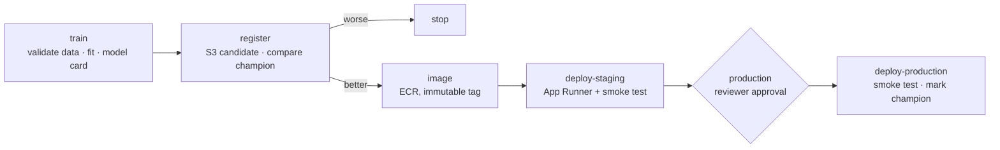

# ML CI/CD with GitHub Actions

A complete **continuous training and delivery pipeline** for an ML model, built only with GitHub Actions and AWS managed services:

**validate data → train → quality gate → champion/challenger → container → staging → human approval → production.**

- **Data validation:** schema, null, range and label-balance checks stop the pipeline before training on bad data.
- **Training:** a scikit-learn gradient-boosting model. Every run writes `metrics.json` and a **model card**, which also appears in the workflow summary.
- **Gate:** an absolute minimum ROC-AUC, **no regression** against the current champion, and no worse calibration (Brier score).
- **Registry:** S3 with versioned artifacts and a `champion.json` pointer that's updated only after a successful production deploy.
- **Serving:** a FastAPI container with the model baked in, validated input (Pydantic) and `/health`, `/metadata` and `/predict` endpoints.
- **Deploy:** AWS App Runner for staging and production. Each deploy waits for the service and smoke-tests that the **expected model version** is serving.
- **Security:**
  - GitHub OIDC, with **one IAM role per GitHub environment**, each trusted only from `environment:<name>`
  - no stored AWS keys
  - immutable, scanned ECR images
  - the production environment requires a reviewer

> **Status:** code complete and validated in CI (11 unit tests, a training run, the Docker image build, a container smoke test and terraform validate). Deploy it to your own account to run the full pipeline.

## Pipeline



## Layout

| Path | What it holds |
|---|---|
| `src/mlpipe/data.py` | Validation rules and a synthetic dataset |
| `src/mlpipe/train.py`, `evaluate.py` | Training, metrics, model card, promotion rules |
| `src/mlpipe/registry.py` | S3 registry and champion pointer |
| `src/mlpipe/serve.py` | FastAPI model server |
| `.github/workflows/ml-pipeline.yml` | The delivery pipeline (manual trigger or weekly schedule) |
| `terraform/` | Registry bucket, ECR, GitHub OIDC roles per environment, App Runner services |

## Set up

```bash
terraform -chdir=terraform init -backend-config=backend.hcl
terraform -chdir=terraform apply -var github_repository=<owner>/<repo>
```

In GitHub, create the environments **staging** and **production** (add required reviewers to production). Then set these variables in each environment from `terraform output`:

| Variable | staging / production |
|---|---|
| `AWS_ROLE_ARN` | `github_role_arns[env]` |
| `SERVICE_ARN` / `SERVICE_URL` | `service_arns[env]` / `service_urls[env]` |

Also set these repository variables: `REGISTRY_BUCKET`, `ECR_REPOSITORY_URL`, `APPRUNNER_ECR_ROLE_ARN` and `AWS_REGION`. Then run **ml-pipeline**.

## Local

```bash
pip install -r requirements-dev.txt
make test
make serve     # http://localhost:8080/docs
```

## Clean-up

```bash
terraform -chdir=terraform destroy -var github_repository=<owner>/<repo>
```
